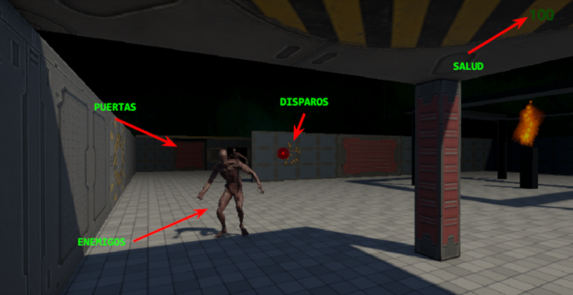

#### C.E. DVRV

### Programación y Motores de Videojuegos

#### Project: Crazy Zombie

`[Unity ver.: 6.0.28f1]`

## Diseño

### Concepto

- **Título:** Crazy Zombie

- **Plataforma:** PC

- **Género:** FPS

- **Cámara:** Juego 3D con vista en primera persona

- **Descripción:**

  - Juego para un jugador en el que el objetivo es sobrevivir a las hordas de zombies que nos atacan.

  - Dispondremos de un arma con la que disparar proyectiles y destruir los zombies.

### Elementos de diseño

### Mecánicas

### Mecánicas adicionales (práctica)

